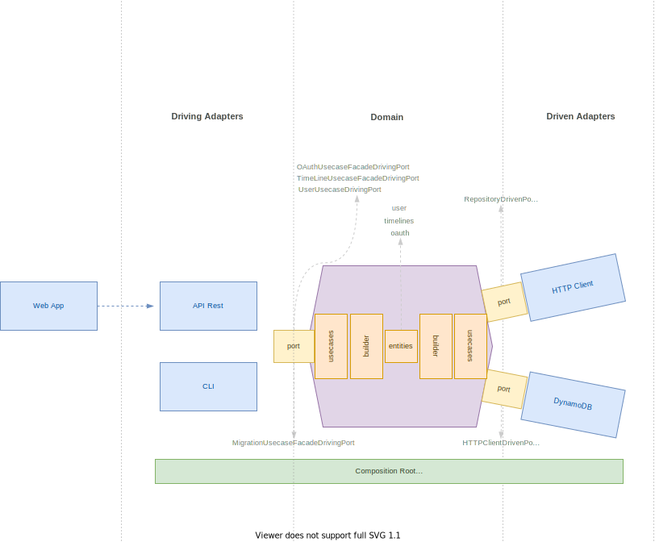
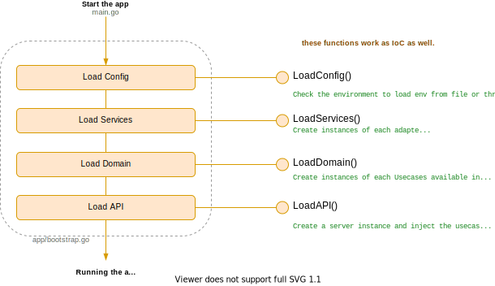

# Tweets Timeline Challenge

### Important

This project has been developed to complete a challenge, nevertheless, it has been focused on having in mind questions about hexagonal architecture, modularization, automated tasks, best practices, clean code, pipelines to CI/CD, and so on. It means, it has been considered and developed as if it was a real development but contains some experiments to put some personal ideas about modularization, architecture, patterns, and so on as well.

On the other hand, there are different kinds of tasks that this project can do such as building docker images, starting services using docker-compose, building binaries, deploying on Fargate using AWS copilot, and so on. So for that reason, there are different dependencies required by each task. But also, it's important to highlight that to execute any task, `make` command is used through a `Makefile` file. This is the entry point to centralize all commands not only to test locally each task but also, to use in github actions workflows in order to avoid  duplication of tasks through scripting (check `.github/workflows/app-ci-cd.yml`). But not only is useful to avoid duplication, but also it is useful because when github actions workflows are broken for some unexpected reason, but you can also test locally what happens with the process and solve it with ease.

- [Tweets Timeline Challenge](#tweets-timeline-challenge)
    - [Important](#important)
  - [How to start](#how-to-start)
    - [Requirements](#requirements)
      - [general](#general)
      - [testing](#testing)
      - [building](#building)
      - [deploying](#deploying)
    - [Start to develop](#start-to-develop)
    - [Deploy API and Web on AWS Farget](#deploy-api-and-web-on-aws-farget)
    - [Available commands](#available-commands)
- [Architecture](#architecture)
  - [Summary](#summary)
  - [Initialization Life Cycle](#initialization-life-cycle)

## How to start

### Requirements

#### general

- [`golang >= 1.18`](https://go.dev/dl/)
- `nodejs`
- `yarn`
- `make`
- `git`
- [*`docker-compose`](https://docs.docker.com/compose/) (optional just if you want to execute Dynamodb locally)
- `local.env` or `.env` at the root of this project.
  - If you want to use Dynamodb locally, so you need to create a `local.env` file and copy the environment definitions from `.env.example`.
  - If you want to use Dynamodb on the AWS service, so you need to create a `.env` file and copy the environment definitions from `.env.example`.
    > it's important to highlight that none `*.env` file will be used to run/deploy the api and web applications on the cloud. All environment variables must be set in each cloud service.
- AWS credentials
- Twitter credencials
  
#### testing

- `mockery` to generate mocks for unit testing. check [here](https://github.com/vektra/mockery) to install it

#### building

- `docker`
- `docker-compose`

#### deploying

- `aws-cli`
- `aws-copilot`
- `docker`
- `curl`

### Start to develop

1. Get AWS and Twitter credentials
2. Create a env file: `local.env` if you want to use DynamoDB locally, or `.env` if you want to use DynamoDB on AWS cloud.
   - if you use `local.env`, then execute `make start-dynamo` to start DynamoDB locally. (It use docker-compose to start an DynamoDB instance over Docker)
3. Fill the env files
4. Execute `make prepare-app` in order to migrate the oauth and user tables and get a token from Twitter to be stored on auth table.
5. Execute `make start-api` to start to develop / test the API
6. Execute `make start-web` to start to develop / test the WEB. Since the web app use environment variables to connect with the API, the same environment variables set on the env file are
   used (check `next.config.js`)

### Deploy API and Web on AWS Farget

Although this project is trying to follow CI/CD process to test and deploy on the cloud, just CI has been implemented yet, so the deployments to test both the API and Web are execute locally using `aws copilot`.

### Available commands

You can check `Makefile` file to see all available commands. The majority of commands are used in github actions workflow.

- __Create mocks__: this is used full to create mocks to execute unit tests.
  - `$ make create-mocks`
- __Unit tests__ to run unit tests (you need to create mocks previously)
  - `$ make unit-tests`
- __Integration tests__ to run integration tests (you need to have set environment variables in `.env` file to tests this API with DynamoDB and Twitter)
  - `$ make integration-tests`
- __End to end tests__ not implemented yet, but it will be useful to execute end to end tests.
  - `$ make end2end-tests`
- __Start dynamo__ to execute DynamoDB locally using docker-compose (this will download the container if it is not available locally)
  - `$ make start-dynamo`
- __Swagger__ to execute DynamoDB locally using docker-compose (this will download the container if it is not available locally)
  - `$ make swagger`
- __Prepare app__ it is use to migrate the schemas and get a token from twitter to be stored in the oauth schema.
  - `$ make prepare-app`
- __Build app in docker__ it is used in the continuous integration process with github actions workflow to build the API. You don't it in locally, but you can use it to test.
  - `$ make build-app-in-docker`
- __Build web in docker__ it is used in the continuous integration process with github actions workflow to build the Web. You don't it in locally, but you can use it to test.
  - `$ make build-web-in-docker`
- __Build app dependencies in docker__ this is just for testing purpose to build a stage of the Dockerfile.
  - `$ make build-app-dependencies-in-docker`
- __Run app in docker__ build the API in docker if you want check if the execution of the API is right.
  - `$ make run-app-in-docker`
- __Start web__ it is useful when you want to start to develop, this command is just a wrapper of `npm run dev` to point to the web target.
  - `$ make start-web`
  -
- __Start web__ it is useful when you want to start to develop, this command is just a wrapper of `go run ./main.go` to point to the web target.
  - `$ make start-app`

There are other commands just as experiment focused on automate the process to login to AWS and ECR, push the image on ECR and deploy on AWS Fargate.

# Architecture

> Note: the below information does not pretend to be an exhaustive documentation about the architecture and the main concepts, it will only an overview not more, not less.
## Summary
The API has been developed following the concepts about Port and Adapter architecture and clean architecture.

## Initialization Life Cycle

As you can see above image, there are a well establish life cycle of initialization.